<!-- ╔═══════════════════════════════════════════════════════════════╗ -->
<!-- ║  Harini · GitHub Profile README · retro / pixel theme          ║ -->
<!-- ║  Lives in the repo  Harini7798/Harini7798 (repo name==username)║ -->
<!-- ╚═══════════════════════════════════════════════════════════════╝ -->

<!-- ░░░ ANIMATED TYPING HEADER ░░░ -->
<div align="center">

[](https://github.com/Harini7798)

<!-- ░░░ HERO — animated pixel scene (PNG embedded + motion overlays) ░░░ -->


</div>

<!-- ░░░ ABOUT ░░░ -->
## 🚀 About Me

```text
RAG bot alive now
```

- 🤖  I build with machine learning and ship intelligent things.
- 🎮  I like pixel art and arcade-style interfaces.
- 🌱  Currently learning: ML/DL
- 📫  Reach me at: aharini050805@gmail.com

<!-- ░░░ CONTRIBUTION SNAKE ░░░ -->
## 🐍 Contribution Snake

<div align="center">

<picture>
  <source media="(prefers-color-scheme: dark)" srcset="https://raw.githubusercontent.com/Harini7798/Harini7798/output/github-contribution-grid-snake-dark.svg" />
  <source media="(prefers-color-scheme: light)" srcset="https://raw.githubusercontent.com/Harini7798/Harini7798/output/github-contribution-grid-snake.svg" />
  
</picture>

</div>

<!-- The snake stays blank until the GitHub Action runs once. See SETUP.md. -->
